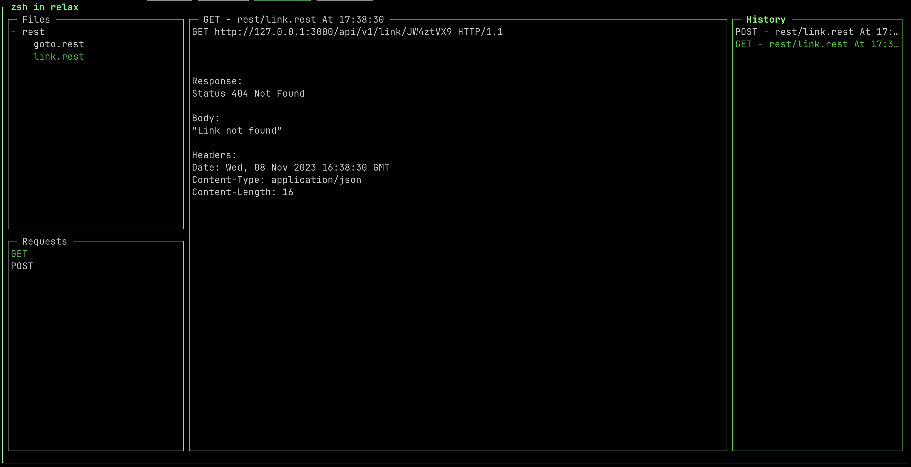

# Relax

A TUI to make request inspired in the VS Code [Rest Client](https://marketplace.visualstudio.com/items?itemName=humao.rest-client) plugin

## Installation

- Make sure you have golang installed.
- Clone this repo.
- `go build`
- chmod +x ./relax
- cp relax /usr/local/bin/relax

## How to use

Execute in the root folder.

`relax`

It will show the folders with **.rest** files inside the project.

## Key Mapping

- Go up `j`
- Go down `k`
- Go to the next panel `<Tab>` or `l`
- Go to previous panel `h`
- Execute Request `<Space>`. Either on the "Requests" panel or in the "Main" panel
